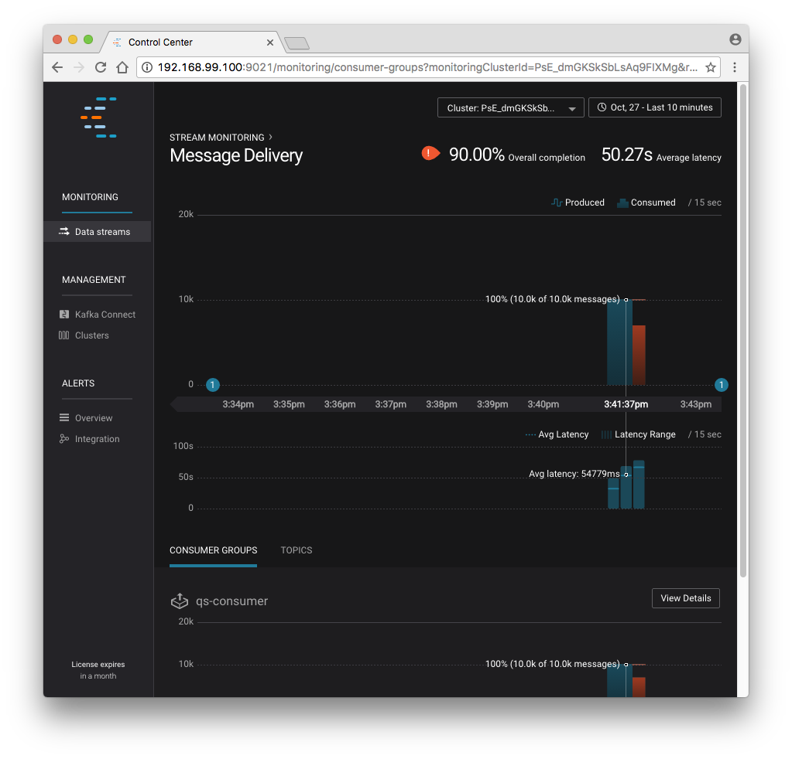
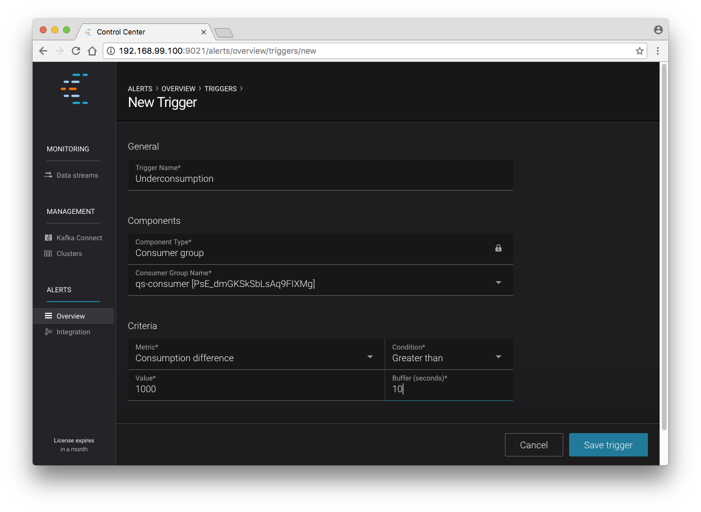
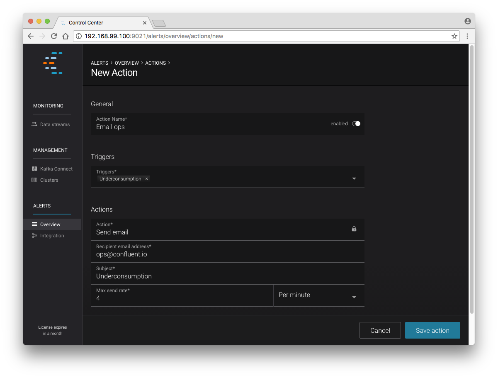
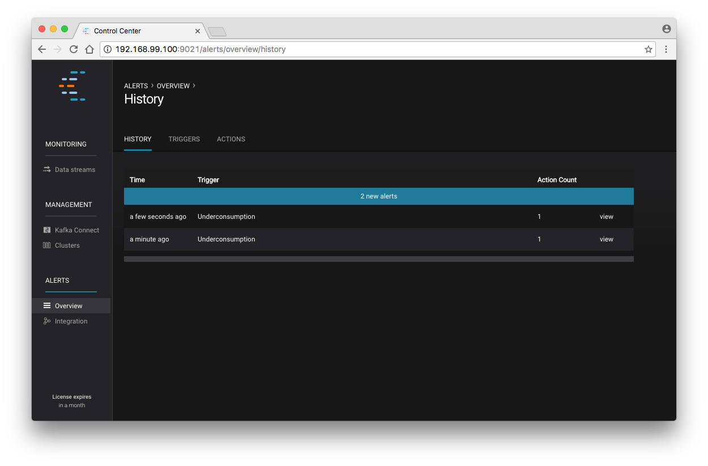

.. _single-node-basic:

Single Node Basic Deployment on Docker
======================================

This tutorial provides a basic guide for deploying a Kafka cluster along with all |cp| components in your Docker
environment. By the end, you will have a functional |cp| deployment that you can use to run applications.

This tutorial builds a single node Docker environment using Docker client. You will configure Kafka and |zk| to store data locally in their
Docker containers.

Prerequisites
    - .. include:: ../../includes/docker-version.rst

    - `curl <https://curl.haxx.se/>`_

=====================================
Step 1: Setup Your Docker Environment
=====================================

.. include:: ../../includes/docker-machine.rst

Create a Docker Network
-----------------------

Create the Docker network that is used to run the Confluent containers.

.. important::
A Docker network is required to enable DNS resolution across your containers. The default Docker network does not have DNS enabled.

.. sourcecode:: console

  $ docker network create confluent

=================================
Step 2. Start the |cp| Components
=================================

Start |zk|
----------

#. Start |zk| and keep this service running.

   .. sourcecode:: console

    $ docker run -d \
        --net=confluent \
        --name=zookeeper \
        -e ZOOKEEPER_CLIENT_PORT=2181 \
        confluentinc/cp-zookeeper:4.1.0

   This command instructs Docker to launch an instance of the ``confluentinc/cp-zookeeper:4.1.0`` container and name it ``zookeeper``.
   Also, the Docker network ``confluent`` and the required ZooKeeper parameter ``ZOOKEEPER_CLIENT_PORT`` are specified.
   For a full list of the available configuration options and more details on passing environment variables into Docker
   containers, see the :ref:`configuration reference docs <config_reference>`.

#. Optional: Check the Docker logs to confirm that the container has booted up successfully and started the |zk| service.

   .. sourcecode:: console

    $ docker logs zookeeper

   With this command, you're referencing the container name that you want to see the logs for.  To list all containers
   (running or failed), you can always run ``docker ps -a``.  This is especially useful when running in detached mode.

   When you output the logs for |zk|, you should see the following message at the end of the log output:

   ::

    [2016-07-24 05:15:35,453] INFO binding to port 0.0.0.0/0.0.0.0:2181 (org.apache.zookeeper.server.NIOServerCnxnFactory)

   Note that the message shows the |zk| service listening at the port you passed in as ``ZOOKEEPER_CLIENT_PORT`` above.

   If the service is not running, the log messages should provide details to help you identify the problem.  A common
   error is:

   * Insufficient resources.  In rare occasions, you may see memory allocation or other low-level failures at startup. This
     will only happen if you dramatically overload the capacity of your Docker host.

Start Kafka
-----------

#. Start Kafka with this command.

   .. sourcecode:: console

      $ docker run -d \
          --net=confluent \
          --name=kafka \
          -e KAFKA_ZOOKEEPER_CONNECT=zookeeper:2181 \
          -e KAFKA_ADVERTISED_LISTENERS=PLAINTEXT://kafka:9092 \
          -e KAFKA_OFFSETS_TOPIC_REPLICATION_FACTOR=1 \
          confluentinc/cp-kafka:4.1.0

   The ``KAFKA_ADVERTISED_LISTENERS`` variable is set to ``kafka:9092``.  This will make Kafka accessible to other
   containers by advertising it's location on the Docker network. The same |zk| port is specified here as the
   previous container.

   The ``KAFKA_OFFSETS_TOPIC_REPLICATION_FACTOR`` is set to ``1`` for a single-node cluster.  If you have three or more
   nodes, you do not need to change this from the default.

#. Optional: Check the logs to see the broker has booted up successfully:

   .. sourcecode:: console

    $ docker logs kafka

   You should see the following at the end of the log output:

   ::

    ....
    [2016-07-15 23:31:00,295] INFO [Kafka Server 1], started (kafka.server.KafkaServer)
    ...
    ...
    [2016-07-15 23:31:00,349] INFO [Controller 1]: New broker startup callback for 1 (kafka.controller.KafkaController)
    [2016-07-15 23:31:00,350] INFO [Controller-1-to-broker-1-send-thread], Starting  (kafka.controller.RequestSendThread)
    ...

.. _test_drive:

=======================================
Step 3. Create a Topic and Produce Data
=======================================

#. Create a topic.  You'll name it ``foo`` and keep things simple by just giving it one partition and only one replica.

   .. sourcecode:: console

    $ docker run \
      --net=confluent \
      --rm confluentinc/cp-kafka:4.1.0 \
      kafka-topics --create --topic foo --partitions 1 --replication-factor 1 \
      --if-not-exists --zookeeper zookeeper:2181

   You should see the following:

   ::

    Created topic "foo".

#. Optional: Verify that the topic was successfully created:

   .. sourcecode:: console

    $ docker run \
      --net=confluent \
      --rm \
      confluentinc/cp-kafka:4.1.0 \
      kafka-topics --describe --topic foo --zookeeper zookeeper:2181

   You should see the following:

   ::

    Topic:foo   PartitionCount:1    ReplicationFactor:1 Configs:
    Topic: foo  Partition: 0    Leader: 1001    Replicas: 1001  Isr: 1001

#. Publish data to your new topic:

   .. sourcecode:: console

    $ docker run \
      --net=confluent \
      --rm \
      confluentinc/cp-kafka:4.1.0 \
      bash -c "seq 42 | kafka-console-producer --request-required-acks 1 \
      --broker-list kafka:9092 --topic foo && echo 'Produced 42 messages.'"

   This command will use the built-in Kafka Console Producer to produce 42 simple messages to the topic. After running the command, you should see the following:

   ::

    Produced 42 messages.

   To complete the story, you can read back the message using the built-in Console consumer:

   .. sourcecode:: console

    $ docker run \
      --net=confluent \
      --rm \
      confluentinc/cp-kafka:4.1.0 \
      kafka-console-consumer --bootstrap-server kafka:9092 --topic foo --from-beginning --max-messages 42

   If everything is working as expected, each of the original messages you produced should be written back out:

   ::

    1
    ....
    42
    Processed a total of 42 messages

You can now continue to :ref:`docker-qs-step-2`.

.. _docker-qs-step-2:

==================
Step 4: Start |sr|
==================

In this step, |sr| is used to create a new schema and send some Avro data to a Kafka topic. Although you would normally
do this from one of your applications, you'll use a utility provided with |sr| to send the data without having
to write any code.

#. Start the |sr| container:

   .. sourcecode:: console

    $ docker run -d \
      --net=confluent \
      --name=schema-registry \
      -e SCHEMA_REGISTRY_KAFKASTORE_CONNECTION_URL=zookeeper:2181 \
      -e SCHEMA_REGISTRY_HOST_NAME=schema-registry \
      -e SCHEMA_REGISTRY_LISTENERS=http://0.0.0.0:8081 \
      confluentinc/cp-schema-registry:4.1.0

#. Optional: Check that it started correctly by viewing the logs.

   .. sourcecode:: console

    $ docker logs schema-registry

#. Launch a second |sr| container in interactive mode (``-it``) and then execute the ``kafka-avro-console-producer`` utility
   from there. This publishes data to a new topic that will leverage the |sr|.

   .. sourcecode:: console

    $ docker run -it --net=confluent --rm confluentinc/cp-schema-registry:4.1.0 bash

   #. Run the Kafka console roducer against your Kafka cluster, instruct it to write to the topic ``bar``, read each line
      of input as an Avro message, validate the schema against the |sr| at the specified URL, and indicate the format of
      the data.

      .. sourcecode:: console

        # /usr/bin/kafka-avro-console-producer \
          --broker-list kafka:9092 --topic bar \
          --property schema.registry.url=http://schema-registry:8081 \
          --property value.schema='{"type":"record","name":"myrecord","fields":[{"name":"f1","type":"string"}]}'

      After it has started, the process waits for you to enter messages, one per line, and will send them immediately
      when you hit the ``Enter`` key.

      .. tip:: If you hit ``Enter`` with an empty line, it will be interpreted as a null value and cause an error. You
               can simply restart the console producer again to continue sending messages.

   #. Enter these messages:

      .. sourcecode:: console

        {"f1": "value1"}
        {"f1": "value2"}
        {"f1": "value3"}

   #. Use ``Ctrl+C`` or ``Ctrl+D`` to stop the producer client. You can then type ``exit`` to leave the container altogether.

========================
Step 5: Start REST Proxy
========================

This section describes how to deploy the REST Proxy container and then consume data from the Confluent REST Proxy service.
This demonstrates how to read the data produced from outside the container on your local machine via the REST Proxy. The REST
Proxy depends on the |sr| when producing and consuming Avro data, so must pass in the details for the detached |sr| container
that you launched in the previous step.

#. Start up the REST Proxy:

   .. sourcecode:: console

    $ docker run -d \
      --net=confluent \
      --name=kafka-rest \
      -e KAFKA_REST_ZOOKEEPER_CONNECT=zookeeper:2181 \
      -e KAFKA_REST_LISTENERS=http://0.0.0.0:8082 \
      -e KAFKA_REST_SCHEMA_REGISTRY_URL=http://schema-registry:8081 \
      -e KAFKA_REST_HOST_NAME=kafka-rest \
      confluentinc/cp-kafka-rest:4.1.0

   For the next two steps, you're going to use curl commands to talk to the REST Proxy. Your deployment steps thus far
   have ensured that both the REST Proxy container and the |sr| container are accessible directly through network ports
   on your local host. The REST Proxy service is listening at http://localhost:8082.

#. Launch a new Docker container to execute your commands from:

   .. sourcecode:: console

    $ docker run -it --net=confluent --rm confluentinc/cp-schema-registry:4.1.0 bash

   #. Create a consumer instance.

      .. sourcecode:: console

        # curl -X POST -H "Content-Type: application/vnd.kafka.v1+json" \
          --data '{"name": "my_consumer_instance", "format": "avro", "auto.offset.reset": "smallest"}' \
          http://kafka-rest:8082/consumers/my_avro_consumer

      You should see the following:

      .. sourcecode:: console

        {"instance_id":"my_consumer_instance","base_uri":"http://kafka-rest:8082/consumers/my_avro_consumer/instances/my_consumer_instance"}

   #. Retrieve data from the ``bar`` topic in your cluster. The messages will be decoded, translated to JSON, and included
      in the response. The schema used for deserialization is retrieved automatically from the |sr| service. You configured
      this by setting the ``KAFKA_REST_SCHEMA_REGISTRY_URL`` variable on startup.

      .. sourcecode:: console

        # curl -X GET -H "Accept: application/vnd.kafka.avro.v1+json" \
          http://kafka-rest:8082/consumers/my_avro_consumer/instances/my_consumer_instance/topics/bar

      You should see the following output:

      .. sourcecode:: console

        [{"key":null,"value":{"f1":"value1"},"partition":0,"offset":0},{"key":null,"value":{"f1":"value2"},"partition":0,"offset":1},{"key":null,"value":{"f1":"value3"},"partition":0,"offset":2}]

   #. Use ``Ctrl+C`` or ``Ctrl+D`` to stop the producer client. You can then type ``exit`` to leave the container altogether.

========================
Step 6: Start |c3-short|
========================

:ref:`control_center` is a web-based tool for managing and monitoring Apache Kafka. This portion of the quick start provides
an overview of how to use |c3| with console producers and consumers to monitor consumption and latency.

Stream Monitoring
-----------------

#. Start |c3-short|, binding its data directory to the directory you just created and its HTTP interface to port 9021.

   .. sourcecode:: console

    $ docker run -d \
      --name=control-center \
      --net=confluent \
      --ulimit nofile=16384:16384 \
      -p 9021:9021 \
      -v /tmp/control-center/data:/var/lib/confluent-control-center \
      -e CONTROL_CENTER_ZOOKEEPER_CONNECT=zookeeper:2181 \
      -e CONTROL_CENTER_BOOTSTRAP_SERVERS=kafka:9092 \
      -e CONTROL_CENTER_REPLICATION_FACTOR=1 \
      -e CONTROL_CENTER_MONITORING_INTERCEPTOR_TOPIC_PARTITIONS=1 \
      -e CONTROL_CENTER_INTERNAL_TOPICS_PARTITIONS=1 \
      -e CONTROL_CENTER_STREAMS_NUM_STREAM_THREADS=2 \
      -e CONTROL_CENTER_CONNECT_CLUSTER=http://kafka-connect:8082 \
      confluentinc/cp-enterprise-control-center:4.1.0

   |c3-short| will create the topics it needs in Kafka, including the URL for a Kafka Connect cluster that is created in a later step.

#. Optional: Verify that it started correctly by searching its logs with the following command:

   .. sourcecode:: console

    $ docker logs control-center | grep Started

   You should see the following:

   .. sourcecode:: console

    [2016-08-26 18:47:26,809] INFO Started NetworkTrafficServerConnector@26d96e5{HTTP/1.1}{0.0.0.0:9021} (org.eclipse.jetty.server.NetworkTrafficServerConnector)
    [2016-08-26 18:47:26,811] INFO Started @5211ms (org.eclipse.jetty.server.Server)

#. To see the |c3-short| UI, open the link http://localhost:9021 in your browser.

   If you are running Docker Machine, the UI will be running at ``http://<docker-host-ip>:9021``. You can find the Docker
   Host IP by running this command:

   .. sourcecode:: console

    $ docker-machine ip confluent

   .. tip:: If your Docker daemon is running on a remote machine (such as an AWS EC2 instance), you must allow TCP access
            to that instance on port 9021. This is done in AWS by adding a "Custom TCP Rule" to the instance's security
            group; the rule should all access to port 9021 from any source IP.

   Initially, the Stream Monitoring UI will have no data.

   .. figure:: ../../images/c3-quickstart-init.png
    :width: 600px

   Confluent Control Center Initial View

#. Run the console producer and consumer with monitoring interceptors configured and see the data in |c3-short|.  First
   you must create a topic for testing.

   .. sourcecode:: console

    $ docker run \
      --net=confluent \
      --rm confluentinc/cp-kafka:4.1.0 \
      kafka-topics --create --topic c3-test --partitions 1 --replication-factor 1 --if-not-exists --zookeeper zookeeper:2181

#. Use the console producer with the monitoring interceptor enabled to send data

   .. sourcecode:: console

    $ while true;
    do
      docker run \
        --net=confluent \
        --rm \
        -e CLASSPATH=/usr/share/java/monitoring-interceptors/monitoring-interceptors-4.1.0.jar \
        confluentinc/cp-kafka-connect:4.1.0 \
        bash -c 'seq 10000 | kafka-console-producer --request-required-acks 1 --broker-list kafka:9092 --topic c3-test --producer-property interceptor.classes=io.confluent.monitoring.clients.interceptor.MonitoringProducerInterceptor --producer-property acks=1 && echo "Produced 10000 messages."'
        sleep 10;
    done

#. Use the built-in Kafka Console Producer to produce 10000 simple messages on a 10 second interval to the ``c3-test`` topic.
   After running the command, you should see the following:

   ::

    Produced 10000 messages.

   The message will repeat every 10 seconds, as successive iterations of the shell loop are executed.   You can terminate
   the client with a ``Ctrl+C``.

#. Use the console consumer with the monitoring interceptor enabled to read the data.  Run this command in a separate
   terminal window (prepared with the ``eval $(docker-machine env confluent)`` as described earlier).

   .. sourcecode:: console

    $ OFFSET=0
    $ while true;
    do
      docker run \
        --net=confluent \
        --rm \
        -e CLASSPATH=/usr/share/java/monitoring-interceptors/monitoring-interceptors-4.1.0.jar \
        confluentinc/cp-kafka-connect:4.1.0 \
        bash -c 'kafka-console-consumer --consumer-property group.id=qs-consumer --consumer-property interceptor.classes=io.confluent.monitoring.clients.interceptor.MonitoringConsumerInterceptor --bootstrap-server kafka:9092 --topic c3-test --offset '$OFFSET' --partition 0 --max-messages=1000'
      sleep 1;
      let OFFSET=OFFSET+1000
    done

   If everything is working as expected, each of the original messages you produced should be written back out:

   .. sourcecode:: console

    1
    ....
    1000
    Processed a total of 1000 messages

In this step you have intentionally setup a slow consumer to consume at a rate of 1000 messages per second. You'll soon
reach a steady state where the producer window shows an update every 10 seconds while the consumer window shows bursts of
1000 messages received every 1 second. The monitoring activity should appear in the |c3-short| UI after 15 to 30 seconds.
If you don't see any activity, use the scaling selector in the upper left hand corner of the web page to select a smaller
time window (the default is 4 hours, and you'll want to zoom in to a 10-minute scale). You will notice there will be moments
where the bars are colored red to reflect the slow consumption of data.

Alerts
------

Confluent |c3-short| provides alerting functionality to notify you when anomalous events occur in your cluster. This
section assumes the console producer and consumer you launched to illustrate the stream monitoring features
are still running in the background.

The Alerts and Overview tabs on the lefthand navigation sidebar displays a history of all triggered events. To begin receiving
alerts, you'll need to create a trigger. Click the "Triggers" navigation item and then select "+ New trigger".

Let's configure a trigger to fire when the difference between your actual consumption and expected consumption is greater
than 1000 messages:

    New trigger

Set the trigger name to be "Underconsumption", which is what will be displayed on the history page when your trigger fires.
You must select a specific consumer group (``qs-consumer``) for this trigger.   That's the name of the group you specified
above in your invocation of ``kafka-console-consumer``.

Set the trigger metric to be "Consumption difference" where the condition is "Greater than" 1000 messages. The buffer
time (in seconds) is the wall clock time you will wait before firing the trigger to make sure the trigger condition is
not too transient.

After saving the trigger, |c3-short| will now prompt us to associate an action that will execute when your newly created
trigger fires. For now, the only action is to send an email. Select your new trigger and choose maximum send rate for your
alert email.

    New action

Let's return to your trigger history page. In a short while, you should see a new trigger show up in your alert history.
This is because you setup your consumer to consume data at a slower rate than your producer.

    A newly triggered event

===========================
Step 7: Start Kafka Connect
===========================

In this section, a simple data pipeline is created by using Kafka Connect. You will read data from a file and write that
data to a new file.  You will then extend the pipeline to show how to use Connect to read from a database table.

Kafka Connect stores all its stateful data (configuration, status, and internal offsets for connectors) directly in Kafka
topics. You will create these topics in the Kafka cluster you have running from the steps above.

.. tip:: You can allow Connect to auto-create these topics by enabling the ``auto.create.topics.enable`` setting. However,
         it is recommended that you manually create these topics. With manual creation you can control settings like replication
         factor and number of partitions.

#. Start up a container with Kafka Connect.

   .. sourcecode:: console

    $ docker run \
      --net=confluent \
      --rm \
      confluentinc/cp-kafka:4.1.0 \
      kafka-topics --create --topic quickstart-offsets --partitions 1 \
      --replication-factor 1 --if-not-exists --zookeeper zookeeper:2181

#. Create a topic for storing data that you'll be sending to Kafka.

   .. sourcecode:: bash

    $ docker run \
      --net=confluent \
      --rm \
      confluentinc/cp-kafka:4.1.0 \
      kafka-topics --create --topic quickstart-data --partitions 1 \
      --replication-factor 1 --if-not-exists --zookeeper zookeeper:2181

#. Optional: Verify that the topics are created before moving on:

   .. sourcecode:: console

    $ docker run \
       --net=confluent \
       --rm \
       confluentinc/cp-kafka:4.1.0 \
       kafka-topics --describe --zookeeper zookeeper:2181

#. Create a FileSourceConnector and directories for storing the input and output files. This starts a Connect worker in
   distributed mode and points Connect to the three topics that were created in the first step of this quick start.

   .. sourcecode:: console

      $ docker run -d \
        --name=kafka-connect \
        --net=confluent \
        -e CONNECT_PRODUCER_INTERCEPTOR_CLASSES=io.confluent.monitoring.clients.interceptor.MonitoringProducerInterceptor \
        -e CONNECT_CONSUMER_INTERCEPTOR_CLASSES=io.confluent.monitoring.clients.interceptor.MonitoringConsumerInterceptor \
        -e CONNECT_BOOTSTRAP_SERVERS=kafka:9092 \
        -e CONNECT_REST_PORT=8082 \
        -e CONNECT_GROUP_ID="quickstart" \
        -e CONNECT_CONFIG_STORAGE_TOPIC="quickstart-config" \
        -e CONNECT_OFFSET_STORAGE_TOPIC="quickstart-offsets" \
        -e CONNECT_STATUS_STORAGE_TOPIC="quickstart-status" \
        -e CONNECT_CONFIG_STORAGE_REPLICATION_FACTOR=1 \
        -e CONNECT_OFFSET_STORAGE_REPLICATION_FACTOR=1 \
        -e CONNECT_STATUS_STORAGE_REPLICATION_FACTOR=1 \
        -e CONNECT_KEY_CONVERTER="org.apache.kafka.connect.json.JsonConverter" \
        -e CONNECT_VALUE_CONVERTER="org.apache.kafka.connect.json.JsonConverter" \
        -e CONNECT_INTERNAL_KEY_CONVERTER="org.apache.kafka.connect.json.JsonConverter" \
        -e CONNECT_INTERNAL_VALUE_CONVERTER="org.apache.kafka.connect.json.JsonConverter" \
        -e CONNECT_REST_ADVERTISED_HOST_NAME="kafka-connect" \
        -e CONNECT_LOG4J_ROOT_LOGLEVEL=DEBUG \
        -e CONNECT_PLUGIN_PATH=/usr/share/java \
        -e CONNECT_REST_HOST_NAME="kafka-connect" \
        -v /tmp/quickstart/file:/tmp/quickstart \
        confluentinc/cp-kafka-connect:4.1.0

#. Optional: Verify that the Connect worker is up by running the following command to search the logs:

   .. sourcecode:: console

        $ docker logs kafka-connect | grep started

   You should see the following:

   .. sourcecode:: console

        [2016-08-25 18:25:19,665] INFO Herder started (org.apache.kafka.connect.runtime.distributed.DistributedHerder)
        [2016-08-25 18:25:19,676] INFO Kafka Connect started (org.apache.kafka.connect.runtime.Connect)

#. Create the directory to store the input and output data files.

   .. sourcecode:: console

        $ docker exec kafka-connect mkdir -p /tmp/quickstart/file

#. Create a connector for reading a file from disk.

   #. Create a file with some data.

      .. sourcecode:: console

        $ docker exec kafka-connect sh -c 'seq 1000 > /tmp/quickstart/file/input.txt'

   #. Create the connector using the Kafka Connect REST API.

      .. sourcecode:: console

        $ docker exec kafka-connect curl -s -X POST \
          -H "Content-Type: application/json" \
          --data '{"name": "quickstart-file-source", "config": {"connector.class":"org.apache.kafka.connect.file.FileStreamSourceConnector", "tasks.max":"1", "topic":"quickstart-data", "file": "/tmp/quickstart/file/input.txt"}}' \
          http://kafka-connect:8082/connectors

      Your output should look like the following:

      .. sourcecode:: console

        {"name":"quickstart-file-source","config":{"connector.class":"org.apache.kafka.connect.file.FileStreamSourceConnector","tasks.max":"1","topic":"quickstart-data","file":"/tmp/quickstart/file/input.txt","name":"quickstart-file-source"},"tasks":[]}

   #. Optional: verify the status of the connector using this curl command:

      .. sourcecode:: console

            $ docker exec kafka-connect curl -s -X GET http://kafka-connect:8082/connectors/quickstart-file-source/status

      You should see the following output including the ``state`` of the connector as ``RUNNING``:

      .. sourcecode:: console

        {"name":"quickstart-file-source","connector":{"state":"RUNNING","worker_id":"kafka-connect:8082"},"tasks":[{"state":"RUNNING","id":0,"worker_id":"kafka-connect:8082"}]}

   #. Optional: Read a sample of 10 records from the ``quickstart-data`` topic to check if the connector is uploading data to
      Kafka. You should run this command in a separate terminal window, retaining the SSH session to the Docker Host for
      later commands.

      .. sourcecode:: console

        $ docker run \
          --net=confluent \
          --rm \
          confluentinc/cp-kafka:4.1.0 \
          kafka-console-consumer --bootstrap-server kafka:9092 --topic \
          quickstart-data --from-beginning --max-messages 10

      You should see the following:

      .. sourcecode:: console

            {"schema":{"type":"string","optional":false},"payload":"1"}
            {"schema":{"type":"string","optional":false},"payload":"2"}
            {"schema":{"type":"string","optional":false},"payload":"3"}
            {"schema":{"type":"string","optional":false},"payload":"4"}
            {"schema":{"type":"string","optional":false},"payload":"5"}
            {"schema":{"type":"string","optional":false},"payload":"6"}
            {"schema":{"type":"string","optional":false},"payload":"7"}
            {"schema":{"type":"string","optional":false},"payload":"8"}
            {"schema":{"type":"string","optional":false},"payload":"9"}
            {"schema":{"type":"string","optional":false},"payload":"10"}
            Processed a total of 10 messages

       Success!  You now have a functioning source connector!

#. Launch a File Sink to read from this topic and write to an output file.  Run the following command from the Docker
   Host session started earlier:

   .. sourcecode:: console

    $ docker exec kafka-connect curl -X POST -H "Content-Type: application/json" \
        --data '{"name": "quickstart-file-sink", \
        "config": {"connector.class":"org.apache.kafka.connect.file.FileStreamSinkConnector", "tasks.max":"1", \
        "topics":"quickstart-data", "file": "/tmp/quickstart/file/output.txt"}}' \
        http://kafka-connect:8082/connectors

   You should see the following output, confirming that the ``quickstart-file-sink`` connector is created and will
   write to ``/tmp/quickstart/file/output.txt``:

   .. sourcecode:: console

    {"name":"quickstart-file-sink","config":{"connector.class":"org.apache.kafka.connect.file.FileStreamSinkConnector","tasks.max":"1","topics":"quickstart-data","file":"/tmp/quickstart/file/output.txt","name":"quickstart-file-sink"},"tasks":[]}

#. Optional: Verify the status of the connector:

   .. sourcecode:: console

    $ docker exec kafka-connect curl -s -X GET http://kafka-connect:8082/connectors/quickstart-file-sink/status

   You should see the following:

   .. sourcecode:: console

    {"name":"quickstart-file-sink","connector":{"state":"RUNNING","worker_id":"kafka-connect:8082"},"tasks":[{"state":"RUNNING","id":0,"worker_id":"kafka-connect:28082"}]}

#. Optional: Check the file to see if the data is present.

   .. sourcecode:: console

    $ docker exec kafka-connect cat /tmp/quickstart/file/output.txt

   You should see all of the data you originally wrote to the input file:

   .. sourcecode:: console

    1
    ...
    1000

=============================
Step 8. Monitor in |c3-short|
=============================

Next you'll see how to monitor the Kafka Connect connectors in |c3-short|.  Because you specified the monitoring interceptors when you deployed the Connect container, the data flows through all of your connectors will monitored in the same ways as the console producer/consumer tasks you executed above.  Additionally, |c3-short| allows us to visually manage and deploy connectors, as you'll see now.

  Select the Management / Kafka Connect link in the |c3-short| navigation bar.  Select the ``SOURCES`` and ``SINKS`` tabs at the top of the page to see that both the source and sink are running.

  .. figure:: ../../images/c3-quickstart-connect-view-src.png
   :scale: 50%

   Confluent Control Center showing a Connect source

  .. figure:: ../../images/c3-quickstart-connect-view-sink.png
   :scale: 50%

   Confluent Control Center showing a Connect sink

 You should start to see stream monitoring data from Kafka Connect in the |c3-short| UI from the running connectors.  Remember that the file contained only 1000 messages, so you'll only see a short spike of topic data.

  .. figure:: ../../images/c3-quickstart-connect-monitoring.png
   :scale: 50%

   Confluent Control Center monitoring Kafka Connect

=======
Cleanup
=======

After you're done, cleanup is simple. Run the command ``docker rm -f $(docker ps -a -q)`` to delete all the containers
you created in the steps above, ``docker volume prune`` to remove any remaining unused volumes, and
``docker network rm confluent`` to delete the network that was created.

If you are running Docker Machine, you can remove the virtual machine with this command: ``docker-machine rm confluent``.

You must explicitly shut down Docker Compose. For more information, see the `docker-compose down <https://docs.docker.com/compose/reference/down/>`_
documentation. This will delete all of the containers that you created in this quick start.

.. sourcecode:: bash

   $ docker-compose down

==========
Next Steps
==========

- For examples of how to add mounted volumes to your host machines, see :ref:`external_volumes`. Mounted volumes provide a
  persistent storage layer for deployed containers. With a persistent storage layer, you can stop and restart Docker images,
  such as ``cp-kafka`` and ``cp-zookeeper``, without losing their stateful data.
- For examples of more complex target environments, see the :ref:`tutorials_overview`.
- For more information about |sr|, see :ref:`schemaregistry_intro`.
- For a more in-depth Kafka Connect example, see :ref:`connect_quickstart_avro_jdbc`.
