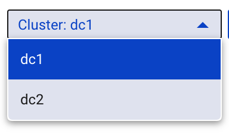
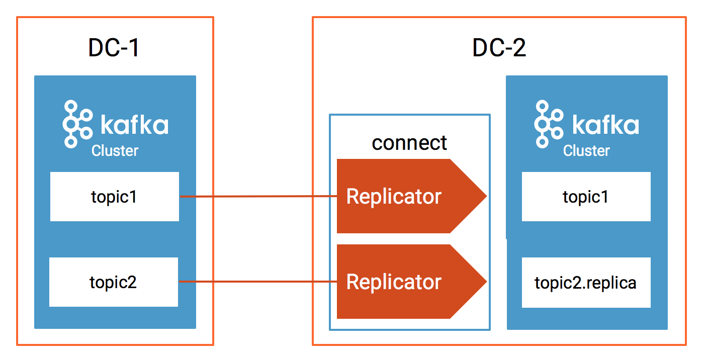
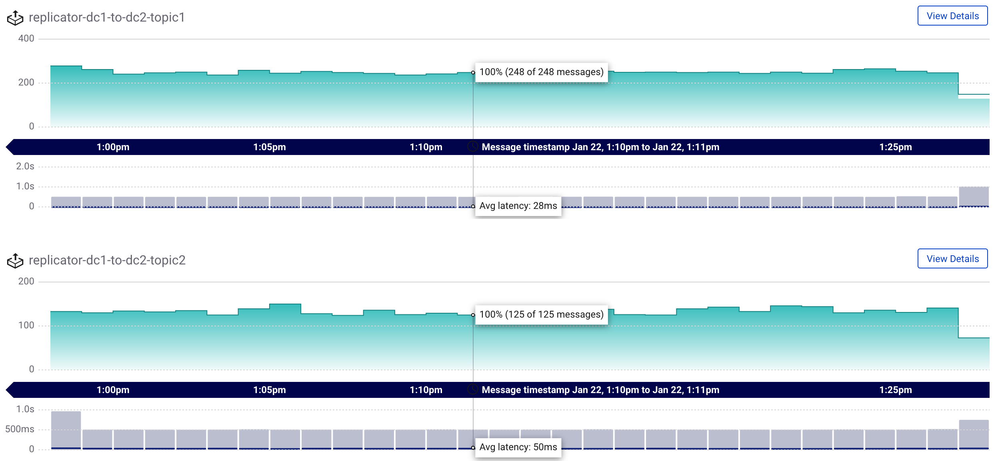
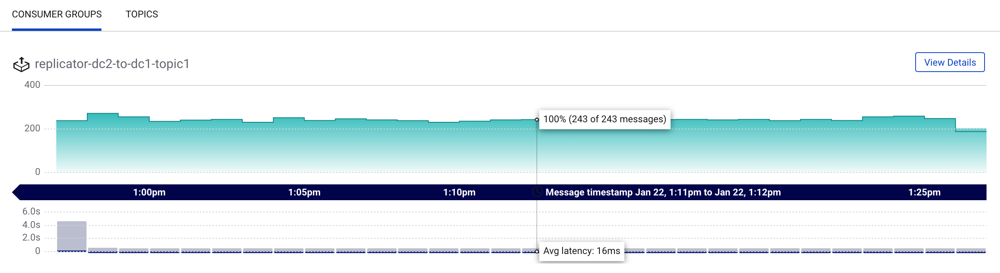
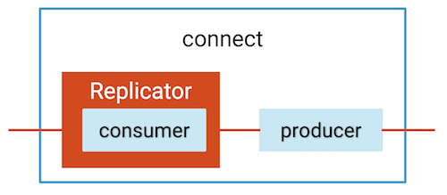
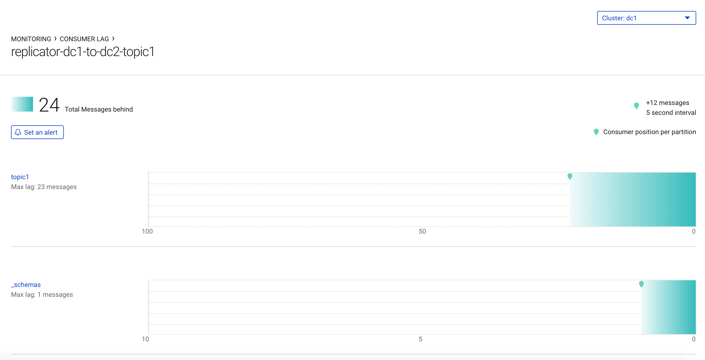
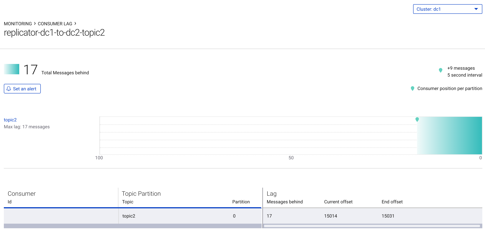

# Overview

This example deploys an active-active multi-datacenter design, with two instances of Confluent Replicator copying data bi-directionally between the datacenters.
Confluent Control Center is running to manage and monitor the cluster.

This is for demo purposes only, not for production.

## Confluent Platform services and their associated ports

|                | DC1                     | DC2                     |
|----------------|-------------------------|-------------------------|
|ZooKeeper       | 2181                    | 2182                    |
|Broker          | 9091                    | 9092                    |
|Schema Registry | 8081 (primary)          | 8082 (secondary)        |
|Connect         | 8381 (copying DC2->DC1) | 8382 (copying DC1->DC2) |
|Control Center  |                         | 9021                    |

## Data generation and topic names

| Datagen Docker container | Origin DC | Origin topics    | Replicator instance          | Destination DC | Destination topics |
|--------------------------|-----------|------------------|------------------------------|----------------|--------------------|
| datagen-dc1-topic1       | dc1       | topic1,_schemas  | replicator-dc1-to-dc2-topic1 | dc2            | topic1,_schemas    |
| datagen-dc1-topic2       | dc1       | topic2           | replicator-dc1-to-dc2-topic2 | dc2            | topic2.replica     |
| datagen-dc2-topic1       | dc2       | topic1           | replicator-dc2-to-dc1-topic1 | dc1            | topic1             |


Confluent Replicator (versions 5.0.1 and higher) prevents cyclic repetition of data between the DC1 `topic1` and DC2 `topic1` by using provenance information in the message headers.

# Run the Demo

## Environment

This has been validated on:

* Docker version 17.06.1-ce
* Docker Compose version 1.14.0 with Docker Compose file format 2.1

## Start the services

Start all services, and print some messages from various topics in each datacenter:

```bash
./start.sh
```

## Stop the services

Stop all services:

```bash
./stop.sh
```

# Monitor Replicator Performance

## Multi-datacenter

In this multi-datacenter environment, there are two Kafka clusters `dc1` and `dc2`.
Confluent Control Center manages both of these.
For simplicity in explaining how it works, in the following sections we will consider replication only from dc1 to dc2.

1. After starting this Docker environment (see [previous section](#start-the-services), navigate your Chrome browser to the Control Center UI at http://localhost:9021 and verify that there are two Kafka clusters `dc1` and `dc2` in the dropdown:



2. This demo has two Kafka Connect clusters, `connect-dc1` and `connect-dc2`. At this time, Control Center can manage only one Kafka Connect cluster. Since we are explaining replication only from dc1 to dc2, we configured Control Center to manage the connect workers in `connect-dc2`.  Recall that Replicator is a source connector, so it runs on the destination cluster (dc2) pulling in data from the origin cluster (dc1).

3. For Replicator copying from `dc1` to `dc2`: Navigate to http://localhost:9021/management/connect/ to verify that `connect-dc2` is running two instances of Replicator: `replicator-dc1-to-dc2-topic1` and `replicator-dc1-to-dc2-topic2`.



## Streams Monitoring

Control Center's monitoring capabilities include monitoring stream performance: verify that all data is consumed, and at what throughput and latency.
This can be on a per-consumer group or per-topic basis.

3. Navigate to http://localhost:9021/monitoring/streams/ and select `dc1` in the cluster dropdown. Verify that there are two consumer groups, one for reach Replicator instance running from dc1 to dc2: `replicator-dc1-to-dc2-topic1` and `replicator-dc1-to-dc2-topic2`. 



4. Navigate to http://localhost:9021/monitoring/streams/ and select `dc2` in the cluster dropdown. Verify that there is one consumer group running from dc2 to dc1: `replicator-dc2-to-dc1-topic1`



## Consumer Lag

Control Center's monitoring capabilities also include consumer lag: how many messages behind are consumer groups from the latest offset in the log.
Replicator has an embedded consumer that reads data from the origin cluster, and it commits its offsets only after the connect worker's producer has committed the data to the destination cluster.
Monitor Replicator consumer lag in the origin cluster: for Replicator copying data from `dc1` to `dc2`, origin cluster is `dc1`.



5. For Replicator copying from `dc1` to `dc2`: Navigate to http://localhost:9021/monitoring/consumer/lag and select `dc1` (origin cluster) in the cluster dropdown.
Verify that there are two consumer groups, one for reach Replicator instance running from dc1 to dc2: `replicator-dc1-to-dc2-topic1` and `replicator-dc1-to-dc2-topic2`.  These show the consumer lag in `dc1` because Replicator has been configured with `offset.topic.commit=true` which commits its own consumer offsets to the origin cluster `dc1` after the messages have been written to the destination cluster.
This consumer lag is available in Control Center and `kafka-consumer-groups`, but is not available via JMX.

a. Click on `replicator-dc1-to-dc2-topic1` to view Replicator's consumer lag in reading `topic1` and `_schemas` (equivalent to `docker-compose exec broker-dc1 kafka-consumer-groups --bootstrap-server broker-dc1:9091 --describe --group replicator-dc1-to-dc2-topic1`)



b. Click on `replicator-dc1-to-dc2-topic2` to view Replicator's consumer log in reading `topic2` (equivalent to `docker-compose exec broker-dc1 kafka-consumer-groups --bootstrap-server broker-dc1:9091 --describe --group replicator-dc1-to-dc2-topic2`)



6. For Replicator copying from `dc1` to `dc2`: Do not confuse Replicator consumer lag in the origin cluster `dc1` with destination cluster `dc2`. Control Center also shows the Replicator consumer lag in `dc2` but this does not mean that Replicator is consuming from these topics in `dc2` (`topic1`, `_schemas`, `topic2.replica`). The reason you see this consumer lag in `dc2` is because Replicator has been configured with `offset.timestamps.commit=true` for which Replicator commits its own offset timestamps of its consumer group in the `__consumer_offsets` topic in the destination cluster `dc2`. This is so that Replicator can resume where it left off when switching to the secondary cluster in case of disaster recovery.

7. Do not confuse consumer lag with an MBean attribute called `records-lag` part of Replicator's embedded consumer.
That attribute reflects whether Replicator's embedded consumer can keep up with the original data production rate, but it does not include replication lag due to producing to the destination cluster.
It is real-time and it is normal for this value to be `0.0`.

```bash
$ docker-compose exec connect-dc2 kafka-run-class kafka.tools.JmxTool --object-name "kafka.consumer:type=consumer-fetch-manager-metrics,partition=0,topic=topic1,client-id=replicator-dc1-to-dc2-topic1-0" --attributes "records-lag" --jmx-url service:jmx:rmi:///jndi/rmi://connect-dc2:9892/jmxrmi
```

# Resuming Java Consumer Applications in Failover

After a disaster event occurs, consumers can switch datacenters and automatically restart consuming data in the destination cluster where they left off in the origin cluster, a capability introduced in Confluent Platform version 5.0.

To use this capability, configure Java consumer applications with the [Consumer Timestamps Interceptor](https://docs.confluent.io/current/multi-dc-replicator/replicator-failover.html#configuring-the-consumer-for-failover), which is shown in this [sample code](https://github.com/confluentinc/examples/blob/5.0.1-post/clients/avro/src/main/java/io/confluent/examples/clients/basicavro/ConsumerMultiDatacenterExample.java).


1. After starting this Docker environment (see [previous section](#start-the-services), run the consumer to connect to DC1 Kafka cluster. It uses the Consumer Timestamps Interceptor, and configures the consumer group id `java-consumer-topic1`.

```bash
git clone https://github.com/confluentinc/examples.git
cd clients/avro
mvn clean package
mvn exec:java -Dexec.mainClass=io.confluent.examples.clients.basicavro.ConsumerMultiDatacenterExample -Dexec.args="topic1 localhost:29091 http://localhost:8081 localhost:29092"
```

Verify in the consumer output that it is reading data originating from both DC1 and DC2:

```bash
...
key = User_1, value = {"userid": "User_1", "dc": "DC1"}
key = User_9, value = {"userid": "User_9", "dc": "DC2"}
key = User_6, value = {"userid": "User_6", "dc": "DC2"}
...
```

2. Even though the consumer is consuming from DC1, there are DC2 consumer offsets committed for the consumer group `java-consumer-topic1`. Run the following command to read from the `__consumer_offsets` topic in DC2.

```bash
$ docker-compose exec broker-dc2 kafka-console-consumer --topic __consumer_offsets --bootstrap-server localhost:29092 --formatter "kafka.coordinator.group.GroupMetadataManager\$OffsetsMessageFormatter" | grep java-consumer
```

Verify that there are some offsets for `java-consumer-topic1`:

```bash
...
[java-consumer-topic1,topic1,0]::OffsetAndMetadata(offset=1142, leaderEpoch=Optional.empty, metadata=, commitTimestamp=1547146285084, expireTimestamp=None)
[java-consumer-topic1,topic1,0]::OffsetAndMetadata(offset=1146, leaderEpoch=Optional.empty, metadata=, commitTimestamp=1547146286082, expireTimestamp=None)
[java-consumer-topic1,topic1,0]::OffsetAndMetadata(offset=1150, leaderEpoch=Optional.empty, metadata=, commitTimestamp=1547146287084, expireTimestamp=None)
...
```

3. Shut down DC1:

```bash
$ docker-compose stop connect-dc1 schema-registry-dc1 broker-dc1 zookeeper-dc1
```

4. Restart the consumer to connect to DC2 Kafka cluster, still using the same consumer group id `java-consumer-topic1`:

```bash
mvn exec:java -Dexec.mainClass=io.confluent.examples.clients.basicavro.ConsumerMultiDatacenterExample -Dexec.args="topic1 localhost:29092 http://localhost:8082 localhost:29092"
```

You should see data sourced from only DC2:

```bash
...
key = User_8, value = {"userid": "User_8", "dc": "DC2"}
key = User_9, value = {"userid": "User_9", "dc": "DC2"}
key = User_5, value = {"userid": "User_5", "dc": "DC2"}
...
```

# Additional Reading

Whitepaper: [Disaster Recovery for Multi-Datacenter Apache Kafka Deployments](https://www.confluent.io/white-paper/disaster-recovery-for-multi-datacenter-apache-kafka-deployments/)
